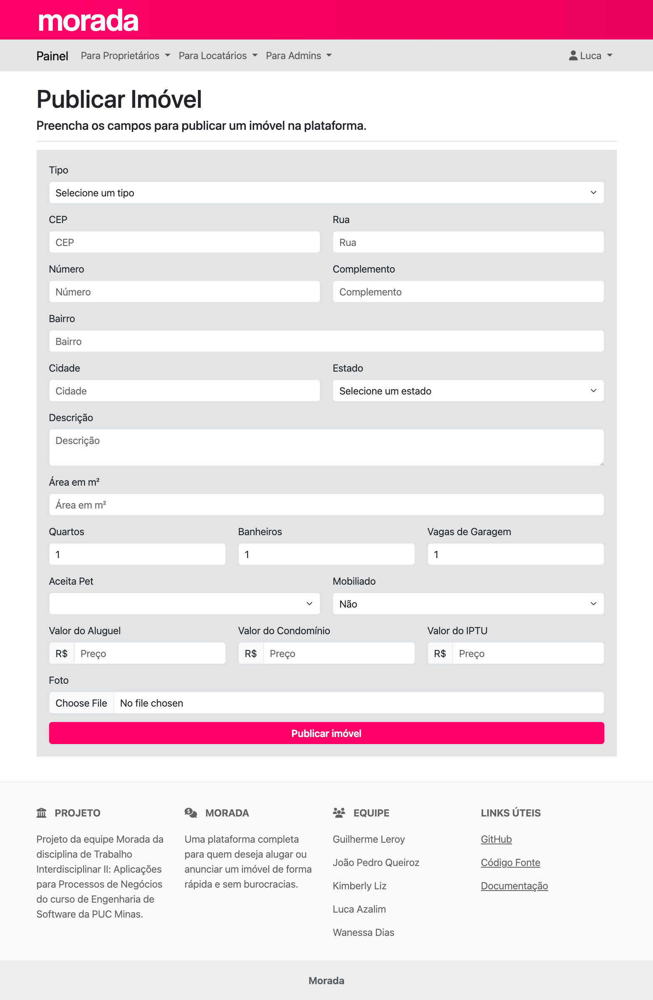

## 6. Interface do sistema

Visão geral da interação do usuário pelas telas do sistema. Apresente as principais interfaces da plataforma.

## 6.1. Telas principal do sistema

A tela inicial da plataforma apresenta menus de navegação, alguns textos informativos, botões de cadastro e login (quando o usuário está deslogado) e o mecanismo de busca de imóveis.

## 6.1. Telas do processo 1

Descrição da tela relativa à atividade 1.

Descrição da tela relativa à atividade 2.

## 6.1. Telas do processo 2

A primeira tela do processo 2 permite a visualização dos imóveis pertencentes a um proprietário, além da interação com o botão que redireciona para a página de publicação de um imóvel.

A segunda tela do processo 2 contém o formulário de publicação do imóvel, onde o usuário pode inserir as informações do imóvel e submeter o formulário para que o imóvel verificado e, se aprovado, publicado.

## 6.1. Telas do processo 3

Descrição da tela relativa à atividade 1.

Descrição da tela relativa à atividade 2.

## 6.1. Telas do processo 4

Descrição da tela relativa à atividade 1.

Descrição da tela relativa à atividade 2.

## 6.1. Telas do processo 5

Descrição da tela relativa à atividade 1.

Descrição da tela relativa à atividade 2.

## 6.1. Telas do processo 6

Descrição da tela relativa à atividade 1.

Descrição da tela relativa à atividade 2.

