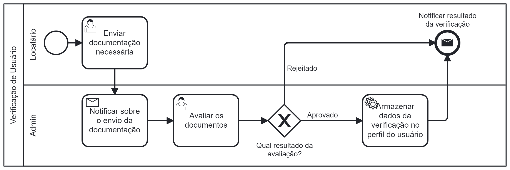

### 3.3.3 Processo 1 – Verificação de usuário

O processo de averiguação do indivíduo para torná-lo um futuro locatário é frequentemente complexo em imobiliárias tradicionais devido à exigência de uma série de documentações e procedimentos, o que pode ser um grande obstáculo no caminho do interessado em alugar um imóvel.

No Morada, tornamos esse processo muito mais simples. Para se tornar um locatário, o indivíduo precisará enviar apenas o RG e o comprovante de renda, ou até mesmo apenas o RG, para nossa plataforma. Esses documentos serão analisados e nossa equipe fornecerá uma resposta o mais breve possível, tornando o processo para a locação de imóveis muito mais ágil e simples.

#### Detalhamento das atividades

**Enviar documentação necessária**

|     **Campo**         | **Tipo**         | **Restrições**    | **Valor default** |
| ---                   | ---              | ---               | ---               |
| RG                    | Arquivo          | png, jpg ou pdf   |  -                |
| Comprovante de Renda  | Arquivo          | pdf               |  -                |

| **Comandos**         |  **Destino**                                         | **Tipo**          |
| ---                  | ---                                                  | ---               |
| Enviar               | Notificar ao administrador sobre envio de documentos | default           |
| Cancelar             | Página inicial                                       | cancel            |

**Avaliar documentos do usuário**

|     **Campo**            | **Tipo**         | **Restrições**    | **Valor default** |
| ---                      | ---              | ---               | ---               |
| RG                       | Arquivo          | png, jpg ou pdf   |  -                |
| Comprovante de Renda     | Arquivo          | pdf               |  -                |

|     **Campo**              | **Tipo**         | **Restrições**    | **Valor default** |
| ---                        | ---              | ---                        | ---               |
| Selecionar resultado       | Seleção única    | 'Aprovado' ou 'Rejeitado'  | -                 |
| Justificar resultado       | Área de texto    |  -                         | -                 |

| **Comandos**         |  **Destino**                                                   | **Tipo**          |
| ---                  | ---                                                            | ---               |
| Aprovar              | Mensagem ao usuário e armazenamento do resultado em seu perfil | default           |
| Rejeitar             | Mensagem ao usuário                                            | cancel            |

**Resultado da verificação**

|     **Campo**              | **Tipo**         | **Restrições**            | **Valor default** |
| ---                        | ---              | ---                       | ---               |
| Resultado                  | Seleção única    | 'Aprovado' ou 'Rejeitado' | -                 |
| Mensagem de justificativa  | Área de texto    | -                         | -                 |

| **Comandos**   |  **Destino**   | **Tipo**          |
| ---            | ---            | ---               |
| Sair da página | Página inicial | default     |

