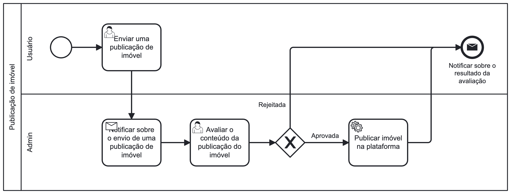

### 3.3.2 Processo 2 – Publicação do imóvel

Em uma imobiliária tradicional, é comum que o anúncio de um imóvel disponível para aluguel seja constituído por informações desestruradas e armazenadas em forma de texto livre. Além disso, geralmente, quem redige o anúncio é um funcionário da imobiliária, e não o proprietário, que é quem mais conhece o imóvel a ser anunciado.

No Morada, o anúncio do imóvel é criado de maneira estruturada, pelo próprio proprietário, o que facilita a criação de mecanismos de busca eficientes para potenciais locatários e garante que as informações mais importantes do imóvel estejam contidas no anúncio.

#### Detalhamento das atividades

**Enviar uma publicação de imóvel**

| Campo                      | Tipo                | Restrições                                 | Valor default     |
|----------------------------|---------------------|--------------------------------------------|-------------------|
| Tipo                       | Seleção Múltipla    | Apartamento, Studio ou Casa                |                   |
| CEP                        | Caixa de Texto      | Formato de CEP                             |                   |
| Logradouro                 | Caixa de Texto      |                                            |                   |
| Número                     | Número              | Número inteiro positivo                    |                   |
| Complemento                | Caixa de Texto      |                                            |                   |
| Bairro                     | Caixa de Texto      |                                            |                   |
| Cidade                     | Caixa de Texto      |                                            |                   |
| Estado                     | Seleção Única       | Lista de estados brasileiros               |                   |
| Descrição                  | Área de Texto       | Máximo de 1000 caracteres                  |                   |
| Metragem                   | Número              | Número inteiro positivo                    |                   |
| Quartos                    | Número              | Número inteiro positivo                    |                   |
| Banheiro                   | Número              | Número inteiro positivo                    |                   |
| Vagas de Garagem           | Número              | Número inteiro positivo                    |                   |
| Aceita Pet                 | Seleção Única       | Sim ou Não                                 |                   |
| Mobiliado                  | Seleção Única       | Sim ou Não                                 |                   |
| Itens Disponíveis no Imóvel | Seleção Múltipla    | Lista de possíveis itens disponíveis no imóvel |                   |
| Itens Disponíveis no Condomínio | Seleção Múltipla | Lista de possíveis itens disponíveis no condomínio | Vazio         |
| Valor do Aluguel           | Número              | Número inteiro positivo                    |                   |
| Valor do Condomínio        | Número              | Número inteiro positivo                    | 0                 |
| Valor do IPTU              | Número              | Número inteiro positivo                    |                   |

| Comandos  | Destino                | Tipo        |
|-----------|------------------------|-------------|
| Enviar    | Notificar sobre o envio de uma publicação de imóvel | default     |
| Cancelar  | Página inicial          | cancel      |

**Avaliar o conteúdo da publicação do imóvel**

| Campo     | Tipo          | Restrições |
|-----------|---------------|------------|
| Mensagem  | Área de Texto |            |

| Comandos | Destino                           | Tipo     |
|----------|----------------------------------|----------|
| Aprovar  | Publicar imóvel na plataforma    | default  |
| Rejeitar | Notificar sobre o resultado da avaliação |          |
