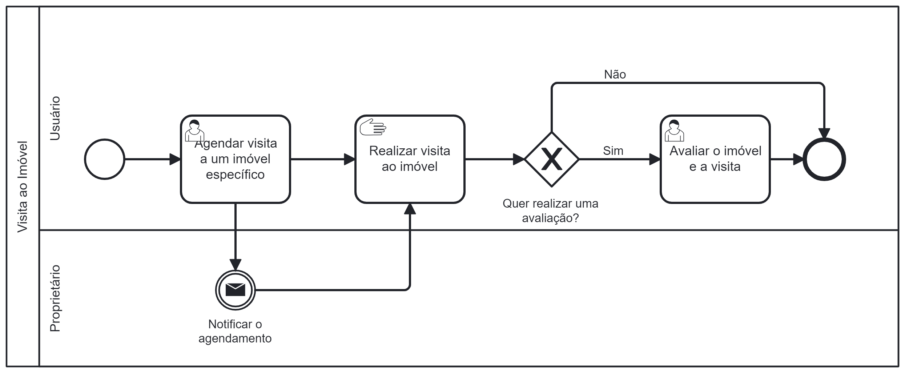

### 3.3.3 Processo 3 – Visita ao imóvel

O agendamento de visitas ao imóvel pode ser um grande empecilho para obter sucesso no processo de fechamento do contrato de aluguel, especialmente quando se trata de imobiliárias tradicionais, visto que é necessário ter um conciliamento de horários entre o futuro locatário, do proprietário/corretor e entre os diversos agendamentos realizados por outras pessoas.

Para isso, o Morada torna tudo mais ágil e eficaz para ambas as partes ao exibir um calendário com todos os horários que o proprietário/corretor tem disponível para agendamento. Isso permite que os interessados em alugar o imóvel escolham facilmente um horário que se adeque às suas necessidades, contribuindo para o sucesso no processo de fechamento de aluguel.

#### Detalhamento das atividades

**Agendar visita ao imóvel**

| **Campo**           | **Tipo**         | **Restrições**                 | **Valor default** |
| ---                 | ---              | ---                            | ---               |
| Tabela com horários | Tabela           | Apresentar semana + horários   |                   |
| Colunas Data        | Data             |                                |                   |
| Linhas Hora         | Hora             | Horário comercial              |                   |

| **Comandos**         |  **Destino**                                | **Tipo**      |
| ---                  | ---                                         | ---           |
| Selecionar horário   | Seleção de horário na página                |               |
| Confirmar            | Notificar ao proprietário sobre agendamento | default       |
| Cancelar             | Cancelar agendamento                        | cancel        |

**Avaliar imóvel e visita**

| **Campo**                        | **Tipo**         | **Restrições**  | **Valor default** |
| ---                              | ---              | ---             | ---               |
| Avaliação com estrelas (símbolo) | Seleção múltipla | Símbolo estrela |  estrelas vazias  |
| Mensagem de avaliação            | Área de texto    | Caracteres      |                   |

| **Comandos**         |  **Destino**                             | **Tipo**          |
| ---                  | ---                                      | ---               |
| Selecionar           | Acrescentar avaliação ao imóvel          |                   |
| Escrever mensagem    | Acrescentar avaliação ao imóvel          |                   |
| Enviar               | Acrescentar e salvar avaliação ao imóvel | default           |
| Fechar               | Página inicial                           | cancel            |
