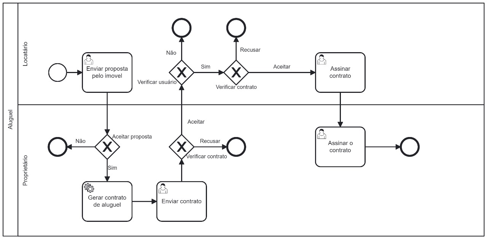

### 3.3.4 Processo 4 – Aluguel de imóvel

O processo de aluguel de um imóvel em imobiliarias tradicionais é cansativo e repleto de burocracia. Prencher papelada, agendar a entrega das chaves e pagar a participação da imobiliária. Tudo isso contribui para que todas as partes precisem reservar parte do seu dia somente para cuidar deste assunto.

No Morada, é possivel realizar todo o processo de aluguel de forma totalmente online. O próprio usuário pode enviar uma proposta ao proprietário que poderá ou não aceitá-la.
O processo de assinatura de contrato também é realizado digitalmente, seguindo todos os processos de segurança e verificação de ambas as partes.

#### Detalhamento das atividades

**Enviar proposta de aluguel**

| **Campo**       | **Tipo**         | **Restrições** | **Valor default** |
| ---             | ---              | ---            | ---               |
| Proposta de valor| Número   | valor monetário |                |

| **Comandos**         |  **Destino**                   | **Tipo** |
| ---                  | ---                            | ---               |
| Aceitar              | Gerar o contrato de locação    | default           |
| Recusar              | Página inicial                 | cancel            |

**Assinar contrato**

| **Campo**       | **Tipo**         | **Restrições** | **Valor default** |
| ---             | ---              | ---            | ---               |
| Assinatura dos participantes | Caixa de texto  |                |                   |
| Data atual      | Data             | Data válida    |                   |

| **Comandos**         |  **Destino**                   | **Tipo**          |
| ---                  | ---                            | ---               |
| Assinar              | Página inicial                 | default           |
| Cancelar             | Página inicial                 | cancel            |

| **Comandos**         |  **Destino**                   | **Tipo** |
| ---                  | ---                            | ---               |
| Confiarmar           | Agendar a entrega das chaves   | default           |
| Recusar              | Nótificar cancelamento no agendamento          | cancel            |
