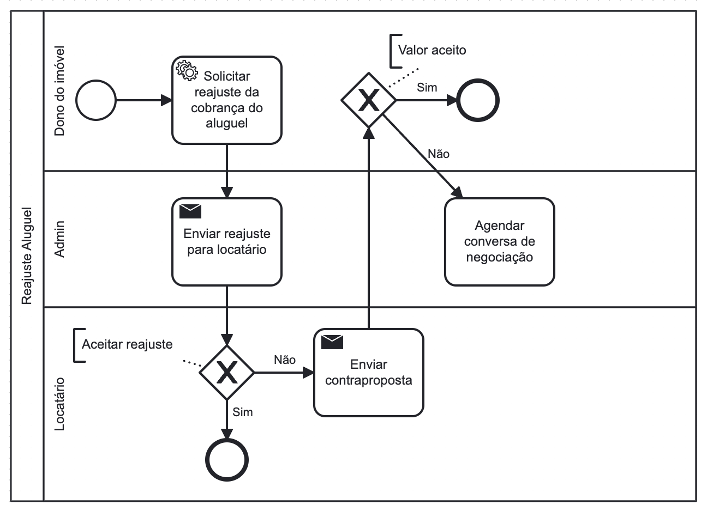

### 3.3.6 Processo 6 – Reajuste do Valor do Aluguel

Nas imobiliárias tradicionais, o processo de Reajuste do Aluguel é informal e desestruturado, geralmente depende do contato inicial de uma partes através de canais não oficiais de comunicação para iniciar negociações.

No Morada, o processo de Reajuste do Valor do Aluguel garante objetividade ao proprietário e locatário, fornecendo um canal de negociação ágil estruturado exclusivamente para garantir que cheguem a um acordo de forma simples e eficaz.

#### Detalhamento das atividades

**Solicitar reajuste do aluguel**

| **Campo**       | **Tipo**         | **Restrições** | **Valor default** |
| ---             | ---              | ---            | ---               |
|  Valor aluguel | Numérico |   Valor positivo, menor que 10.000.000        |                   |

| **Comandos**         |  **Destino**                   | **Tipo** |
| ---                  | ---                            | ---               |
| Enviar | Página de aluguéis | Default |
| Cancelar          | Pagina de aluguéis  |          Cancel         |

**Análise reajuste flexível**

| **Campo**       | **Tipo**         | **Restrições** | **Valor default** |
| ---             | ---              | ---            | ---               |
|  Reajuste aceito/não | Seleção única |  Deve ser selecionado        |             |
|  Valor aluguel | Numérico |   Valor positivo, menor que Reajuste anterior.     |                   |
| Contraproposta definitiva/flexível | Seleção única             |           |               |

| **Comandos**         |  **Destino**                   | **Tipo**          |
| ---                  | ---                            | ---               |
| Aceitar               | Página de aluguéis            |          Default  |
| Rejeitar             |       Página de aluguéis       |              |

**Análise reajuste definitivo**

| **Campo**       | **Tipo**         | **Restrições** | **Valor default** |
| ---             | ---              | ---            | ---               |
|  Reajuste aceito/não | Seleção única |  Deve ser selecionado        |             |

| **Comandos**         |  **Destino**                   | **Tipo**          |
| ---                  | ---                            | ---               |
| Aceitar               | Página de aluguéis            |        Default  |
| Rejeitar             |  Página de recisão contratual   |   Cancel           |

