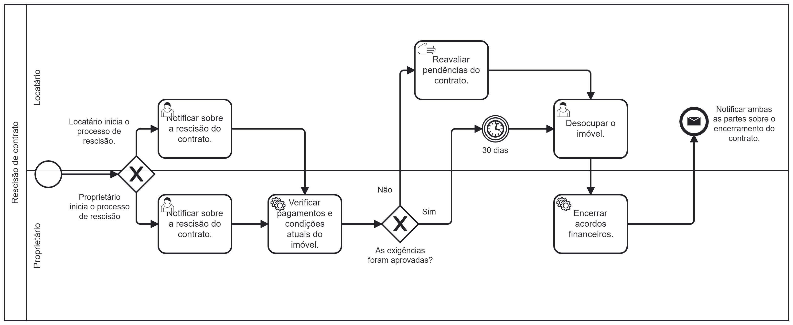

### 3.3.1 Processo 7 – Rescisão de contrato

Uma rescisão de contrato é um procedimento formal em que uma ou ambas as partes envolvidas decidem encerrar o acordo existente. Isso pode ocorrer por uma variedade de razões, incluindo ausência de pagamento, divergências entre as partes, conclusão do processo, mudanças nas situações previstas ou simplesmente porque ambas as partes concordam que é do interesse encerrar o aluguel. 

No Morada, a rescisão do contrato ocorrerá por meio de uma notificação formal. As partes deverão cumprir todas as cláusulas contratuais relacionadas ao processo de rescisão, como prazos de aviso prévio - 30 dias de antecedência - e condições específicas de rescisão, conforme previsto no documento original. Em suma, ainda que o encerramento, geralmente, ocorra de maneira amigável, em situações de desacordo, a resolução poderá exigir mediação judiciária, a fim de encerrar a movimentação de maneira justa e legal, protegendo os direitos e interesses de ambas as partes envolvidas.

#### Detalhamento das atividades

**Notificar sobre rescisão do contrato**

| **Campo**           | **Tipo**         | **Restrições**                                                 | **Valor default** |
| ---                 | ---              | ---                                                            | ---               |
| Área de texto       | Texto            | mínimo de 300 caracteres                                       | Área de texto     |

| **Comandos**         |  **Destino**                                        | **Tipo**        |
| ---                  | ---                                                 | ---             |
| Mensagem             | Notificar os envolvidos sobre início do processo    | default         |
| Enviar               | Notificar os envolvidos sobre início do processo    | default         |

**Verificar pagamentos e condições atuais do imóvel**

| **Campo**                   | **Tipo**                        | **Restrições**    | **Valor default** |
| ---                         | ---                             | ---               | ---               |
| Arquivo                     | Comprovante de pagamentos       | Enviar em PDF     | --                |
| Data e hora                 | Verificar as condições do imóvel| Horário comercial | Horário comercial |

| **Comandos**         |  **Destino**                                         | **Tipo**          |
| ---                  | ---                                                  | ---               |
| Mensagem             | Página inicial                                       |  Seleção Única    |
| Enviar               | Página inicial                                       |  Seleção Única    |

**Notificar ambas as partes sobre o encerramento do contrato**

| **Campo**                   | **Tipo**                        | **Restrições**                | **Valor default** |
| ---                         | ---                             | ---                           | ---               |
| Área de texto               | Texto                           | mínimo de 300 caracteres      | Área de texto     |

| **Comandos**         |  **Destino**                                         | **Tipo**          |
| ---                  | ---                                                  | ---               |
| Enviar               | Notificar sobre o encerramento do contrato           |  default          |
| Cancelar	           | Página inicial	                                      |  cancel           |

