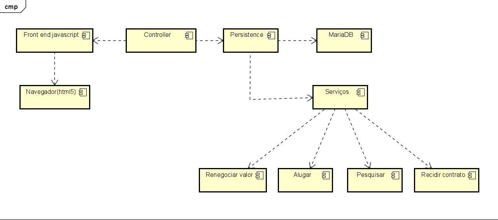
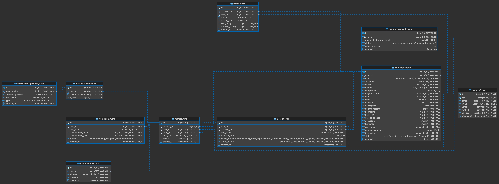

## 4. Projeto da solução

### 4.1. Diagrama de classes

_Acrescente uma breve descrição sobre o diagrama apresentado. Descreva cada uma de suas classes._

### 4.2. Diagrama de componentes

_Apresente o diagrama de componentes da aplicação, indicando os elementos da arquitetura e as interfaces entre eles. Faça uma descrição sucinta dos componentes indicando o papel de cada um deles dentro da arquitetura/estilo/padrão arquitetural. Indique também quais componentes serão reutilizados (navegadores, SGBDs, middlewares, etc), quais componentes serão adquiridos por serem proprietários e quais componentes precisam ser desenvolvidos._

_Apresente uma descrição detalhada dos artefatos que constituem o diagrama de componentes._

Exemplo: conforme diagrama apresentado, as entidades participantes da solução são:

- **Componente 1** - Lorem ipsum dolor sit amet, consectetur adipiscing elit. Cras nunc magna, accumsan eget porta a, tincidunt sed mauris. Suspendisse orci nulla, sagittis a lorem laoreet, tincidunt imperdiet ipsum. Morbi malesuada pretium suscipit.
- **Componente 2** - Praesent nec nisi hendrerit, ullamcorper tortor non, rutrum sem. In non lectus tortor. Nulla vel tincidunt eros.

### 4.3. Modelo de dados

_Apresente o modelo de dados por meio de um modelo relacional ou Diagrama de Entidade-Relacionamento (DER) que contemple todos os conceitos e atributos apresentados no item anterior._ 

### 4.4. Tecnologias

_Descreva qual(is) tecnologias você vai usar para resolver o seu problema, ou seja, implementar a sua solução. Liste todas as tecnologias envolvidas, linguagens a serem utilizadas, serviços web, frameworks, bibliotecas, IDEs de desenvolvimento, e ferramentas. Apresente também uma figura explicando como as tecnologias estão relacionadas ou como uma interação do usuário com o sistema vai ser conduzida, por onde ela passa até retornar uma resposta ao usuário._

| **Dimensão**   | **Tecnologia**  |
| ---            | ---             |
| Persistência   | Hibernate       |
| Front end      | HTML+CSS+JS     |
| Back end       | Java SpringBoot |
| Log do sistema | Log4J           |
| Teste          | JUnit           |
| Deploy         | Github Pages    |

### 4.5. Guias de estilo

Layout padrão do site (HTML e CSS) que será utilizado em todas as páginas com a definição de identidade visual, aspectos de responsividade e iconografia.

Explique as guias de estilo utilizadas no seu projeto.

## Design

Detalhe os layouts que serão utilizados. Apresente onde será colocado o logo do sistema. Defina os menus padrões, entre outras coisas.

## Cores

Apresente a paleta de cores que será utilizada. Uma ferramenta interessante para a criação de palestas de cores é o *Adobe Color* ([https://color.adobe.com/pt/create/color-wheel](https://color.adobe.com/pt/create/color-wheel)).

## Tipografia

Apresente as fontes que serão utilizadas e sua função no site. As principais funções são: Título de página, Título de seção, Rótulos de componentes e Corpo de Texto.

## Iconografia

Defina os ícones que serão utilizados e suas respectivas funções.

Apresente os estilos CSS criados para cada um dos elementos apresentados.
Outras seções podem ser adicionadas neste documento para apresentar padrões de componentes, de menus, etc.

> **Links Úteis**:
>
> - [Como criar um guia de estilo de design da Web](https://edrodrigues.com.br/blog/como-criar-um-guia-de-estilo-de-design-da-web/#)
> - [CSS Website Layout (W3Schools)](https://www.w3schools.com/css/css_website_layout.asp)
> - [Website Page Layouts](http://www.cellbiol.com/bioinformatics_web_development/chapter-3-your-first-web-page-learning-html-and-css/website-page-layouts/)
> - [Perfect Liquid Layout](https://matthewjamestaylor.com/perfect-liquid-layouts)
> - [How and Why Icons Improve Your Web Design](https://usabilla.com/blog/how-and-why-icons-improve-you-web-design/)
