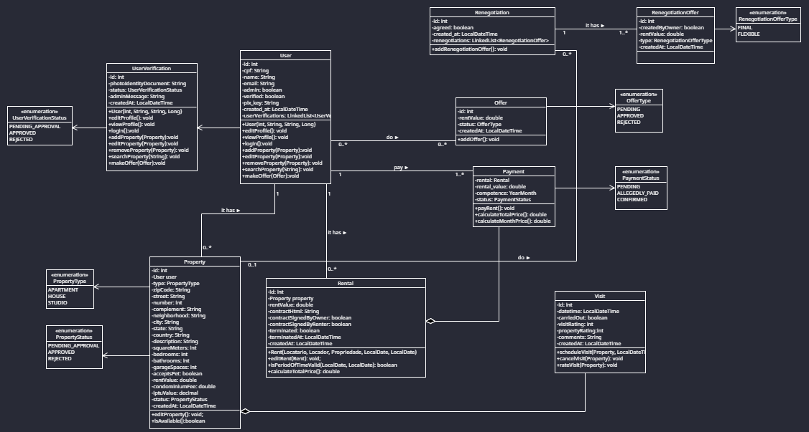
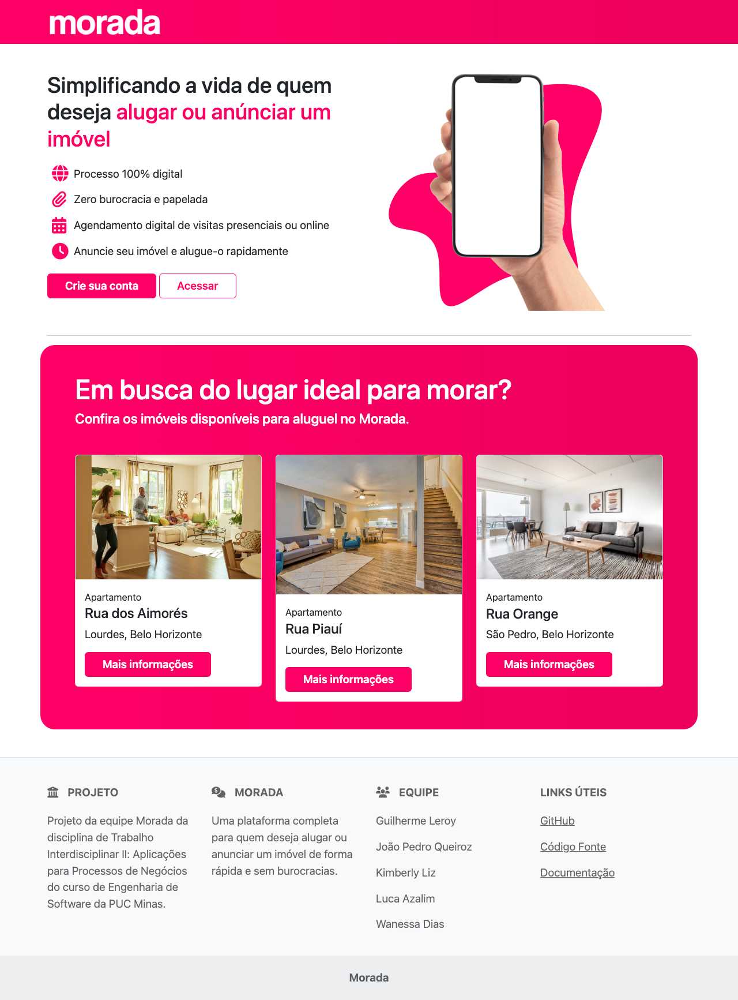
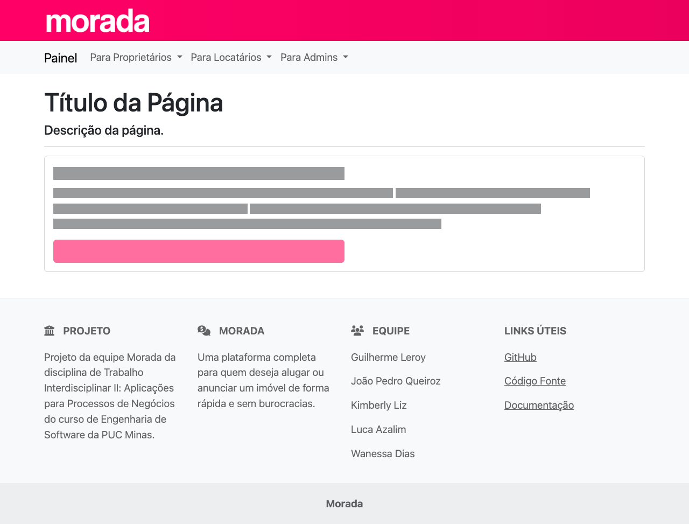

## 4. Projeto da solução

### 4.1. Diagrama de classes

O diagrama de classes do Morada é representado por:

- **User:** representa qualquer tipo de participante dos processos, incluindo Locatário, Proprietário e Admin;
- **UserVerification:** representa uma verificação de usuário;
- **UserVerificationStatus:** representa o status de aprovação de uma verificação de usuário;
- **Property:** representa uma propriedade (imóvel) publicado na plataforma;
- **PropertyType:** representa o tipo de uma propriedade;
- **PropertyStatus:** representa o status de aprovação de uma propriedade;
- **Rental:** representa um aluguel;
- **Oferta:** representa uma proposta de valor de aluguel realizada por um Usuário;
- **Payment:** representa um pagamento de aluguel, que pode já ter sido realizado ou não;
- **PaymentStatus:** representa o status de um pagamento de aluguel;
- **Visit:** representa um agendamento de visita a uma propriedade publicada na plataforma.

### 4.2. Diagrama de componentes

_Apresente o diagrama de componentes da aplicação, indicando os elementos da arquitetura e as interfaces entre eles. Faça uma descrição sucinta dos componentes indicando o papel de cada um deles dentro da arquitetura/estilo/padrão arquitetural. Indique também quais componentes serão reutilizados (navegadores, SGBDs, middlewares, etc), quais componentes serão adquiridos por serem proprietários e quais componentes precisam ser desenvolvidos._

_Apresente uma descrição detalhada dos artefatos que constituem o diagrama de componentes._

Exemplo: conforme diagrama apresentado, as entidades participantes da solução são:

- **Componente 1** - Lorem ipsum dolor sit amet, consectetur adipiscing elit. Cras nunc magna, accumsan eget porta a, tincidunt sed mauris. Suspendisse orci nulla, sagittis a lorem laoreet, tincidunt imperdiet ipsum. Morbi malesuada pretium suscipit.
- **Componente 2** - Praesent nec nisi hendrerit, ullamcorper tortor non, rutrum sem. In non lectus tortor. Nulla vel tincidunt eros.

### 4.3. Modelo de dados

### 4.4. Tecnologias

#### Front End

| **Dimensão**                  | **Tecnologia**         |
| ----------------------------- | ---------------------- |
| Construção de Layouts         | HTML, CSS e JavaScript |
| Framework                     | Bootstrap 5            |
| Iconografia                   | FontAwesome            |
| Gerenciamento de Dependências | NPM                    |
| IDE                           | VS Code                |

#### Back End

| **Dimensão**                  | **Tecnologia**   |
| ----------------------------- | ---------------- |
| Web Service                   | Java Spring Boot |
| Testes                        | JUnit Jupiter    |
| Gerenciamento de Dependências | Maven            |
| ORM                           | Hibernate        |
| SGBD                          | MariaDB          |
| Ambiente de Desenvolvimento   | Docker           |
| IDE                           | IntelliJ         |

### 4.5. Guias de estilo

Todas as páginas do Morada possuem um cabeçalho e um rodapé padrões. O restante do layout varia de acordo com a página. Páginas pertencentes ao Painel do Usuário (/dashboard), por exemplo, possuem um menu de navegação abaixo do cabeçalho.

- [Layout padrão para páginas do Morada](/src/front/README.md#layout-padrão)

#### Design

| Página Inicial                           | Páginas do Painel do Usuário            |
| ---------------------------------------- | --------------------------------------- |
|  |  |

#### Cores

| Rosa Morada               | Cinza Escuro                      | Branco                      |
| ------------------------- | --------------------------------- | --------------------------- |
|  |  |  |
| #ff0066                   | #212529                           | #FFF                        |

#### Tipografia

Será usada a fonte padrão do sistema operacional do usuário.

- [Sobre Tipografia no Bootstrap 5](https://getbootstrap.com/docs/5.3/content/typography/)
- [Sobre _native font stack_ usado pelo Bootstrap 5](https://getbootstrap.com/docs/5.3/content/reboot/#native-font-stack)
- [Artigo da _Smashing Magazine_ sobre _native font stacks_](https://www.smashingmagazine.com/2015/11/using-system-ui-fonts-practical-guide/)

#### Iconografia

Será usado o serviço [FontAwesome](https://fontawesome.com/) em sua versão gratuita.

- [Ícones disponíveis no catálogo do FontAwesome](https://fontawesome.com/icons)
